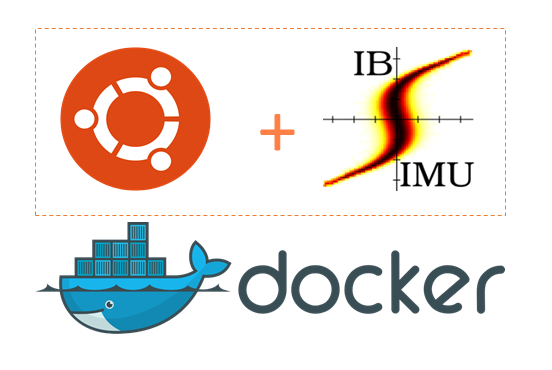

[](https://opensource.org/licenses/GPL-3.0)

# IBSIMU deployment with minimal dependencies in Ubuntu 20.04 Docker container



This repositiry contains docker file creating a docker image with IBSIMU ion beam simulation package compiled from source on Ubuntu 20.04. IBSIMU will be run in graphical mode and requires to set proper DISPLAY environment variable.
Ubuntu inside the image has a non-root sudo enables user ubuntu (modify to your liking).
When running the image first user needs to login and setup environmental variables by running

```console
foo@bar:~$ cd ~/ibsimu/ibsimu_config
foo@bar:~$ ./ibsimu_config.
foo@bar:~$ source ~/.bashrc
foo
```


For testing purposes there are two models in the folder /home/ubuntu/ibsimu/ibsimu_tests
To run the go to the folder, make, then run executable. 
